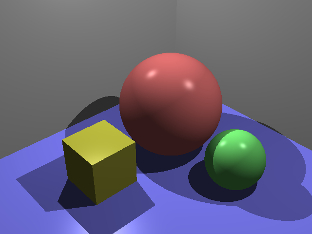

# Simple Ray Tracing 

This repository contains a ray tracing project developed as part of a computer graphics assignment. The project implements several core features of a ray tracer, including Blinn-Phong lighting, shadows, reflections, refractions, and complex scene setup with basic geometric shapes.

## Table of Contents

- [Project Structure](#project-structure)
- [Features](#features)
  - [Blinn-Phong Lighting](#blinn-phong-lighting)
  - [Shadows](#shadows)
  - [Reflections](#reflections)
  - [Refractions](#refractions)
  - [Complex Scene Setup](#complex-scene-setup)
- [Getting Started](#getting-started)
- [Usage](#usage)
- [Results](#results)
- [License](#license)

## Project Structure

The repository includes the following primary files and folders:

- **Source Code**:
  - `Sphere.cpp`, `Raytrace.cpp`, `Main.cpp`: Core source files with ray tracing logic.
  - `Camera.cpp`, `Plane.cpp`, `Triangle.cpp`: Definitions of geometry and camera setup.
  - `Material.h`, `Light.h`: Material and lighting models used in the scenes.
- **Images**: Output images generated by running specific tasks.
  - `img_spheres.png`: Scene rendered with Blinn-Phong lighting (no shadows or reflections).
  - `img_r0.png`, `img_r1.png`, `img_r2.png`: Scenes with reflections of increasing recursion levels.
  - `img_scene2.png`: A complex scene demonstrating multiple objects, reflections, and shadows.
  - `img_refract.png`: Scene with refractive materials.

## Features

### Blinn-Phong Lighting

The ray tracer implements the **Blinn-Phong lighting model** to simulate realistic lighting effects by combining:
- **Ambient Lighting**: Basic light that affects all surfaces equally.
- **Diffuse Reflection**: Based on the angle between the light source and the surface normal.
- **Specular Reflection**: Uses the halfway vector for smoother highlights, providing a slightly more accurate lighting model than traditional Phong.


### Shadows

The ray tracer includes shadow computations to simulate object occlusion by casting rays toward each light source. If an object obstructs the path to a light source, the area is rendered in shadow, creating realistic depth and spatial relationships between objects.

- **No Shadows**:
  
  
- **With Shadows**:
  

### Reflections

Using recursive ray tracing, the project supports mirror-like reflections. By adjusting the recursion level, reflections can bounce off surfaces multiple times, creating layered reflection effects.

- **Reflection Level 1** (One level of reflection):
  

- **Reflection Level 2** (Two levels of reflection):
  

### Refractions

The ray tracer includes refraction calculations based on Snell's Law, allowing realistic rendering of transparent materials such as glass and water. This feature calculates both the refracted and reflected light, combining them using Fresnel equations to achieve a realistic effect.

### Complex Scene Setup

The ray tracer supports complex scenes involving multiple types of primitives (spheres, planes, triangles) with diverse materials. These scenes can include reflections, shadows, refractions, and custom lighting to create visually compelling results.


## Getting Started

### Prerequisites

- C++ compiler (supporting C++11 or later).
- `make` (optional, for building with a Makefile if provided).
- Recommended IDE: Visual Studio, CLion, or any C++ compatible IDE.

### Cloning the Repository

```bash
git clone https://github.com/your-username/ray-tracing-project.git
cd ray-tracing-project
```

## Usage

1. **Compile the Project**:
   If a Makefile is provided, run:
   ```bash
   make
   ```
   Otherwise, compile the main file with:
   ```bash
   g++ -o RayTracer Main.cpp Sphere.cpp Raytrace.cpp -std=c++11
   ```

2. **Run the Project**:
   Execute the compiled binary to render the images.
   ```bash
   ./RayTracer
   ```

3. **Generate Images**:
   - Adjust the code or configuration settings to enable or disable reflections, refractions, shadows, and other features as needed.
   - Render the image and save it in the `images` folder for each feature demonstration.

## Results

See the [Features](#features) section above for a breakdown of rendered images demonstrating each feature.

## License

This project is licensed under the MIT License - see the [LICENSE](LICENSE) file for details.

